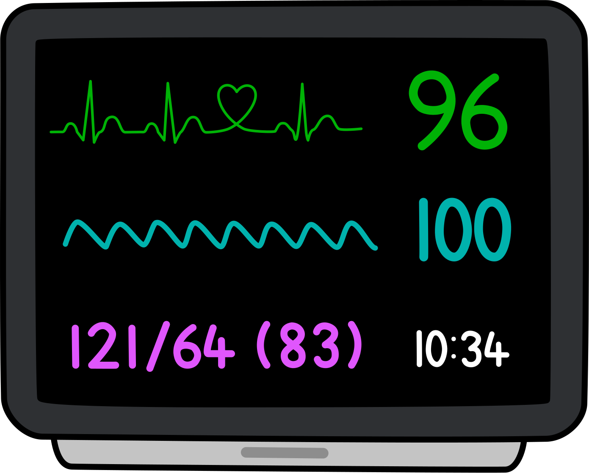

# Gas Notes Simulator 😴

**The [Gas Notes Simulator][gasnotes-sim] is a remote-controlled bedside monitor.**

Simulation is a great way to build strengths and find weaknesses in your self, your team, and your system without all the headaches of putting patients in harm’s way.

This software was created so that simulation tools would be freely available to all.

## Usage
The Gas Notes Simulator is designed to be *reasonably* self-explanatory to the non-technical user.

<b><a href="https://sim.gasnotes.net">You can check out the Gas Notes Simulator online right now!</a></b>

From the homepage, visitors are presented with two options: start a new sim or join an existing one (with a SimCode). Success in either option brings users to a sim's landing page, which prompts users to connect devices and then choose from "monitor" and "controller" modes on each.

Facilitators have the opportunity to adjust:

- Heart rate
- ECG morphology
- Blood pressure (SBP, DBP and MAP)
- Arterial line morphology
- Respiratory rate
- SpO2
- Plethysmograph morphology
- etCO2
- Capnograph morphology

Pending changes are stored and sent *en bloc* at the user's request. There are options to gradually transition parameters and enable/disable traces as desired.

## Architecture
The Gas Notes Simulator uses a client-server architecture to avoid all the headaches of P2P connection in potentially-hostile corporate networks. That means that **the [hosted version][gasnotes-sim] requires an internet connection**.

    

The server component is written in Python using the excellent [Flask][flask] framework. Message passing between clients and the server is done with WebSockets via [SocketIO][socketio] (made easy in Flask with [Flask-SocketIO][flask-socketio]).

### Persistence
For the sake of simplicity, each active SimCode is stored as a text file in `./sim_rooms`. Files with an `mtime` more than 60 minutes ago are periodically pruned by `sim-cleaner.py`.

## Self-Hosting
The [hosted version][gasnotes-sim] runs happily on the smallest [DigitalOcean Droplet](https://m.do.co/c/5248daea7efd) (affiliate link). If you are looking to host your own, check out the [sysadmin notes](sysadmin/SYSADMIN.md).

## Open Source
The Gas Notes Simulator is released under the [MIT License](LICENSE.txt). This software makes use of these open source projects:

- [Flask][flask] (BSD-3-Clause License)
- [Flask-SocketIO][flask-socketio] (MIT License)
- [SocketIO][socketio] (MIT License)
- [pyenv](https://github.com/pyenv/pyenv) (MIT License)
- [pipenv](https://github.com/pypa/pipenv) (MIT License)
- [Homebrew](https://github.com/Homebrew/brew) (BSD-2-Clause License)
- [cloudflared](https://github.com/cloudflare/cloudflared) (Apache-2.0 License)
- [Tailscale](https://github.com/tailscale/tailscale) (BSD-3-Clause License)
- [Twemoji](https://github.com/twitter/twemoji) for the pager (📟) favicon (CC-BY 4.0 License)
    - Converted to .ico via [favicon.io](https://favicon.io/)

And these closed-source ones:

- [Monodraw](https://monodraw.helftone.com/) for the ASCII art
- [Flat UI Colors 2](https://flatuicolors.com/)

[flask]: https://flask.palletsprojects.com
[flask-socketio]: https://flask-socketio.readthedocs.io/en/latest/
[flask-session]: https://flask.palletsprojects.com/en/3.0.x/quickstart/#sessions
[gasnotes]: https://gasnotes.net
[gasnotes-sim]: https://sim.gasnotes.net
[socketio]: https://socket.io
[homebrew]: https://brew.sh/