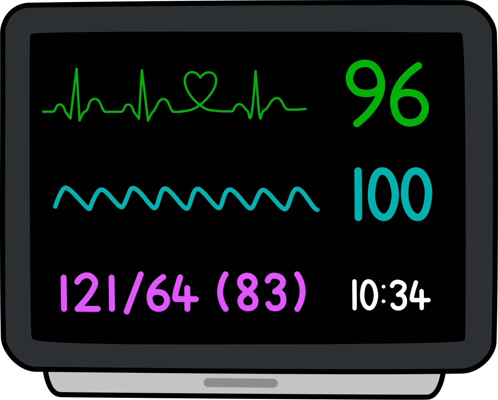
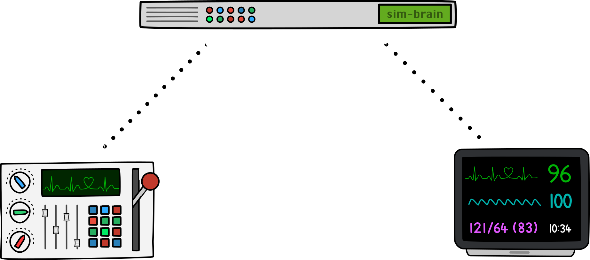

# Simulation Monitor 😴



**[Simulation Monitor][gasnotes-sim] is a remote-controlled bedside monitor.**

Simulation is a great way to build strengths and find weaknesses in your self, your team, and your system without putting patients in harm’s way.

This software was created so that simulation tools would be freely available to all.

## Usage

Simulation Monitor is designed to be _reasonably_ self-explanatory to the non-technical user.

<p align="center"><b><a href="https://sim.gasnotes.net">You can check out Simulation Monitor online right now.</a></b></p>

From the homepage, visitors are presented with two options: start a new sim or join an existing one (with a SimCode). Success in either option brings users to an already-running virtual bedside monitor, which prompts users to connect a controller device.

Facilitators can adjust:

- Heart rate
- ECG morphology
- Blood pressure (SBP, DBP and MAP)
- Arterial line morphology
- Respiratory rate
- SpO<sub>2</sub>
- Plethysmograph morphology
- etCO<sub>2</sub>
- Capnograph morphology
- NIBP (including optional auto-cycling)

Pending changes are stored and sent _en bloc_ at the facilitator's request. There are options to gradually transition parameters and enable/disable traces as desired.

Participants can:

- Pause alarms
- Enable/disable sounds
- Review [investigations](#investigations)
- Check an NIBP (including optional auto-cycling)

## Investigations

Facilitators can choose from a curated list of investigations to send to the monitor:

- Arterial and venous gasses (using the Gas Notes ABG Machine)
- BSL and ketones
- Plain chest x-rays (from various contributors on [Radiopedia][radiopedia])
- Echocardiograms (from [Show Me The POCUS][smtp])

## Architecture

Simulation Monitor uses a client-server architecture to avoid all the headaches of P2P connection in potentially-hostile corporate networks. That means that **the [hosted version][gasnotes-sim] requires an internet connection**.

<p align="center">
    
</p>

The server component is written in Python using the excellent [Flask][flask] framework. Message passing between clients and the server is done with WebSockets via [SocketIO][socketio] (made easy in Flask with [Flask-SocketIO][flask-socketio]).

### Persistence

For the sake of simplicity, each active SimCode is stored as a text file in `./sim_rooms`. The most recent state of each sim room is stored in that file.

## Self-Hosting

The [hosted version][gasnotes-sim] runs happily on the smallest [DigitalOcean Droplet](https://m.do.co/c/5248daea7efd) (affiliate link). If you are looking to host your own, check out the [sysadmin notes](sysadmin/SYSADMIN.md).

## Testing
[Grug have love/hate relationship with test](https://grugbrain.dev/#grug-on-testing).

### Quickstart

```bash
./sysadmin/test.sh
```

When desperate, you can also run test (and the app itself) on your host machine like so:

```bash
./sysadmin/host_test.sh
```

It expects a live non-ratelimited copy of the app to be running on `localhost:8069`

### Details

The test suite is containerised and orchestrated using Docker Compose. `compose.test.yaml` describes two containers:

- `test-server`: runs the Flask app in development mode (rate limiting and caching disabled)
- `test-runner`: runs pytest (see below)

And kills them both when the testing is finished. `test-runner` has two kinds of tests:

- **"In vivo"** tests poke the `test-server` using [Playwright][playwright]
    - I believe a professional would call these **"end to end" tests**
    - Everything runs against Chromium and WebKit
- **"In vitro"** tests are run against a [Flask test-client](https://flask.palletsprojects.com/en/stable/testing/) living within the `test-runner` container
    - I believe a professional would call these **"unit" tests**
    - Allows direct fiddling with app internals

### Coverage
The included test suite is far from complete, but should prevent major whoopsie-doopsies. It currently covers:

- Flask routes (should render *something* reasonable)
- Flask redirects
- Rate limiting behaviour
    - The test environment disables rate limiting by default, except for the dedicated rate-limit test cases
- Basic sending/receiving between controller and monitor

### Debug Mode
Sometimes you just need to see what's happening. `test-debug.sh` will spin up a version of `test-runner` that has a minimal desktop environment and a VNC server.

```bash
./sysadmin/test_debug.sh
```
Then open [vnc://localhost:5901](vnc://localhost:5901). The password is `sim`.

You could also run it on your host machine:

```bash
./sysadmin/host_test_debug.sh
```

## Open Source

Simulation Monitor is released under the [MIT License](LICENSE.txt). This software makes use of these open source projects:

- [Flask][flask] (BSD-3-Clause License)
- [Flask-SocketIO][flask-socketio] (MIT License)
- [SocketIO][socketio] client library (MIT License)
- [uv](https://github.com/astral-sh/uv) (MIT and Apache-2.0 Licenses)
- [ruff](https://github.com/astral-sh/ruff) (MIT License)
- [cloudflared](https://github.com/cloudflare/cloudflared) (Apache-2.0 License)
- [Tailscale](https://github.com/tailscale/tailscale) (BSD-3-Clause License)
- [Twemoji](https://github.com/twitter/twemoji) for the pager (📟) favicon (CC-BY 4.0 License)
    - Converted to .ico via [favicon.io](https://favicon.io/)

And these closed-source ones:

- [Monodraw](https://monodraw.helftone.com/) for the ASCII art
- [Flat UI Colors 2](https://flatuicolors.com/)

[flask]: https://flask.palletsprojects.com
[flask-socketio]: https://flask-socketio.readthedocs.io/en/latest/
[flask-session]: https://flask.palletsprojects.com/en/3.0.x/quickstart/#sessions
[gasnotes]: https://gasnotes.net
[gasnotes-sim]: https://sim.gasnotes.net
[socketio]: https://socket.io
[homebrew]: https://brew.sh/
[smtp]: https://www.showmethepocus.com/
[radiopedia]: https://radiopaedia.org/?lang=us
[playwright]:https://playwright.dev/